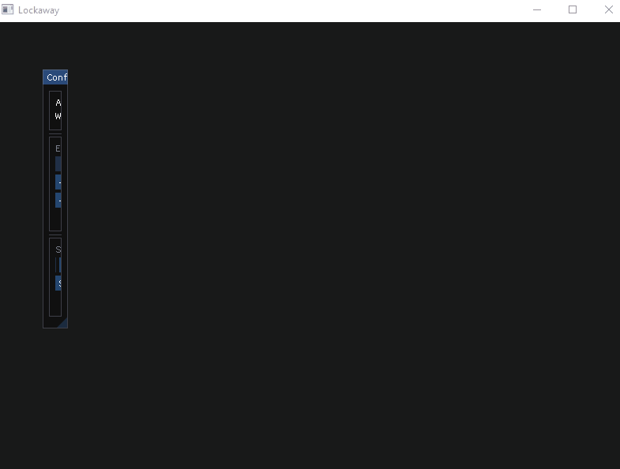
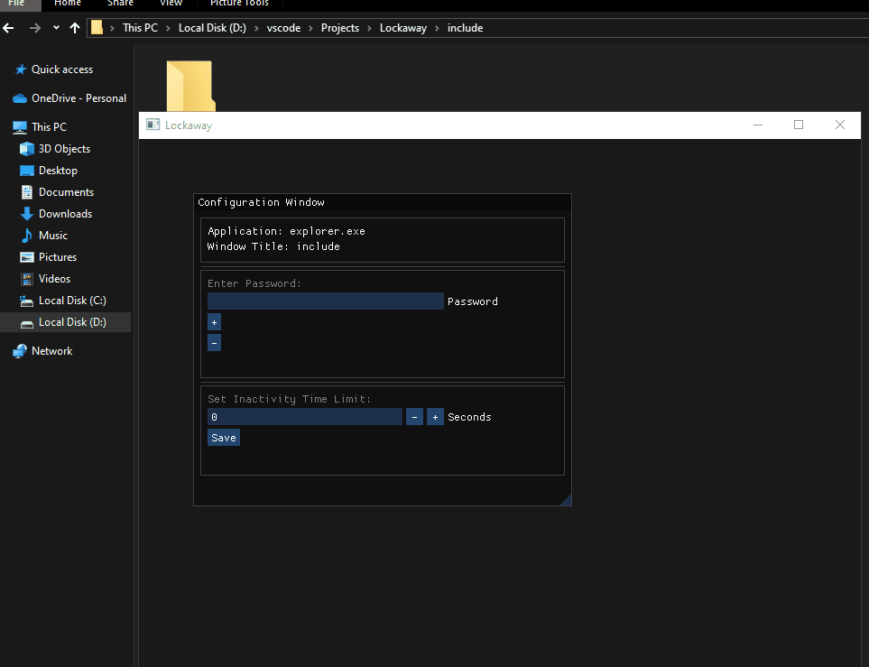

# 🚀 Lockaway (Beta)

### A privacy-focused app to lock "Active Application Windows" after a set period of inactivity.

---

## 🔗 [Download the Latest Release](https://github.com/Omsutar03/lockaway/releases/tag/beta)

---

## ✨ Features
- Automatically **lock inactive windows or browser tabs** after a specified period.
- Treats each browser tab as a separate window for added granularity.
- **Customizable GUI** with resizable and repositionable configuration windows.
- Secure each window or tab with a **password**—required to unlock after inactivity.
- Hotkey Support:
  - **`WIN + SHIFT + L`**: Show or hide the app's GUI instantly.

---

## 📘 How to Use

### **1️⃣ HOTKEY**
- Press `WIN + SHIFT + L` to **toggle the app's GUI visibility**.

### **2️⃣ Configuration**
- Resize the GUI windows by adjusting the arrow-like element at the bottom-right corner.

- Add a password for a specific window or tab:
  1. Enter the password in the configuration window.
  2. Press `+` to lock the current window/tab.
  
  3. The app will display the window/tab name in the configuration window.
- Remove a locked window/tab from the list:
  1. Enter the same password used to lock the window/tab.
  2. Press `-` to remove it.

### **3️⃣ Settings**
- Set the **inactivity period** in seconds before locking.
- Hide the GUI again with the `WIN + SHIFT + L` hotkey.

---

## 🔧 Build Instructions

### Prerequisites:
- **CMake** (minimum version 3.20)
- A compatible C++ compiler (e.g., GCC, Clang, or MSVC)

### Steps:
1. Clone the repository:
   ```sh
   git clone https://github.com/Omsutar03/lockaway.git
   cd lockaway
   ```
2. Create a build directory:
   ```sh
   mkdir build
   ```
3. Generate build files with CMake:
   ```sh
   cmake -S . -B build
   ```
4. Compile the project:
   ```sh
   cmake --build build
   ```
5. The compiled binary can be found in the `build/bin` directory.

---

## 📜 License  
This project is licensed under the **GPL-3.0 License**. See the full license [here](https://github.com/Omsutar03/lockaway/blob/main/LICENSE).

---

## 🙏 Acknowledgments  
- **[Dear ImGui](https://github.com/ocornut/imgui):** For providing a powerful GUI framework.  
- **[GLFW](https://github.com/glfw/glfw):** Dependency for Dear ImGui.

---

## 👤 Contact  
- **Author:** Om Sutar  
- **Email:** [omsutar03@gmail.com](mailto:omsutar03@gmail.com)  
- **GitHub:** [Omsutar03](https://github.com/Omsutar03)  
- **LinkedIn:** [Om Sutar](https://www.linkedin.com/in/omsutar03)  

---

## 🛠️ Contribute  
We welcome contributions! If you encounter any issues or have suggestions, feel free to:
- **Report Issues** on the [GitHub Issues Page](https://github.com/Omsutar03/lockaway/issues).
- **Submit Pull Requests** for fixes or new features.

---

> 🔒 *Lockaway—helping you secure your workspace!*